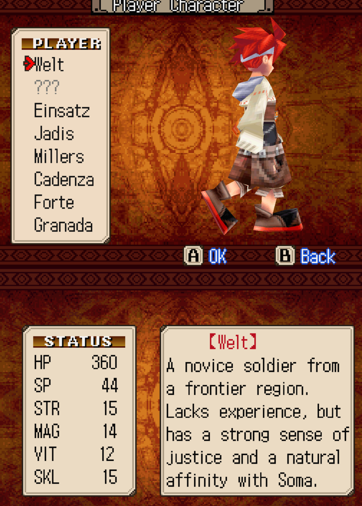
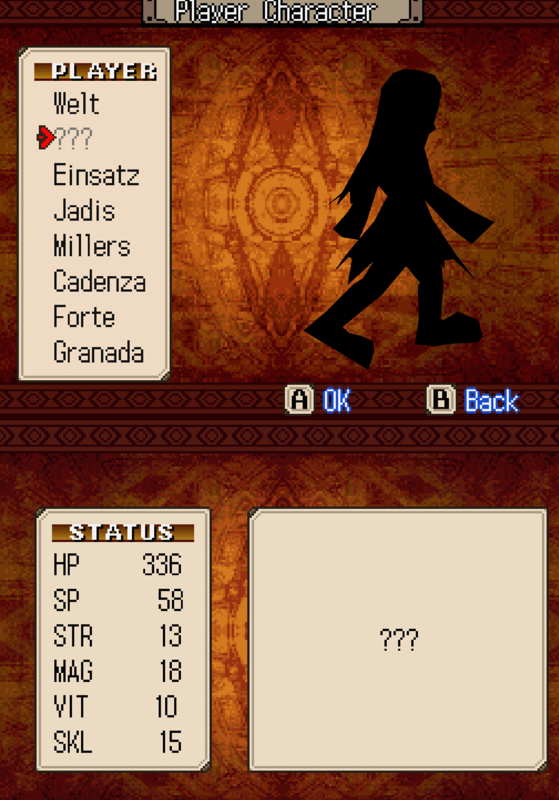
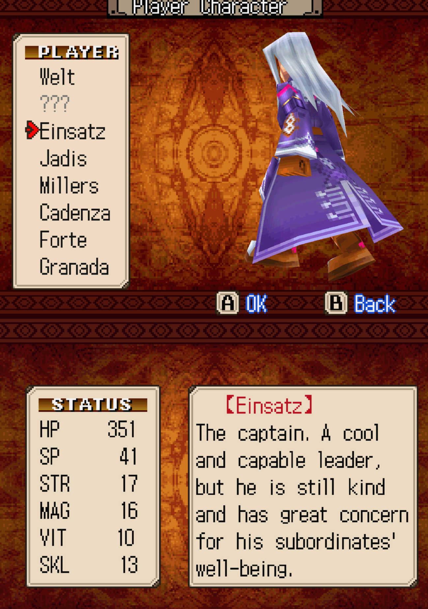
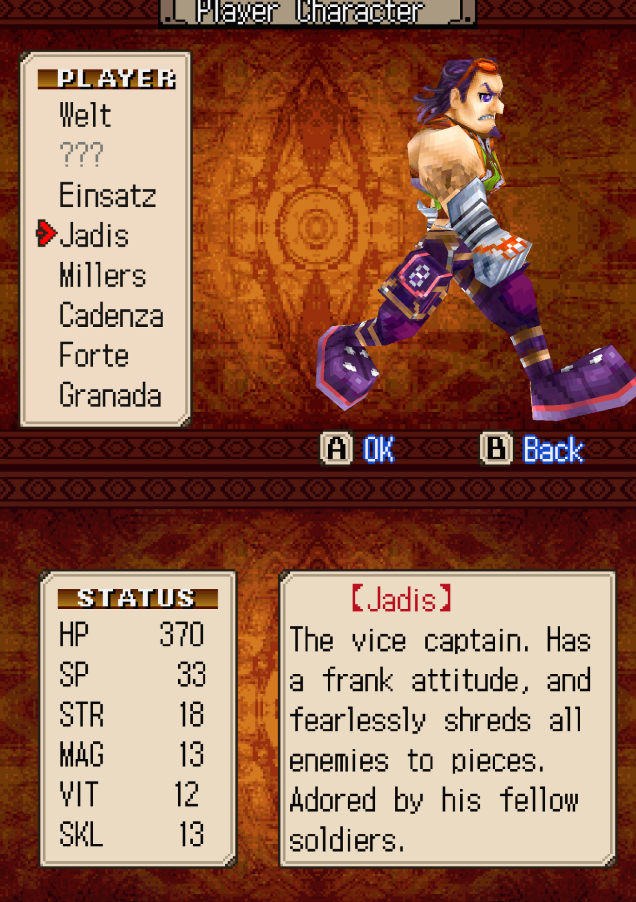
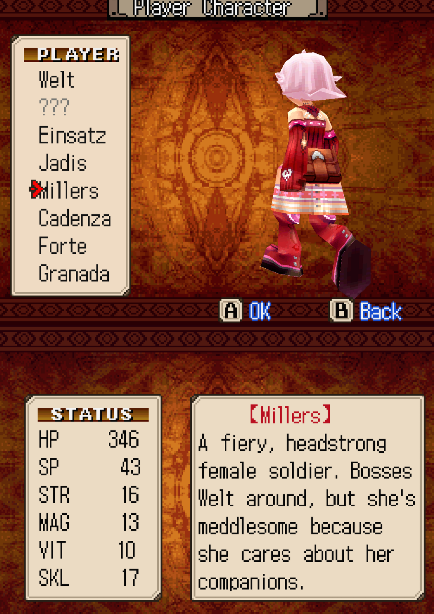
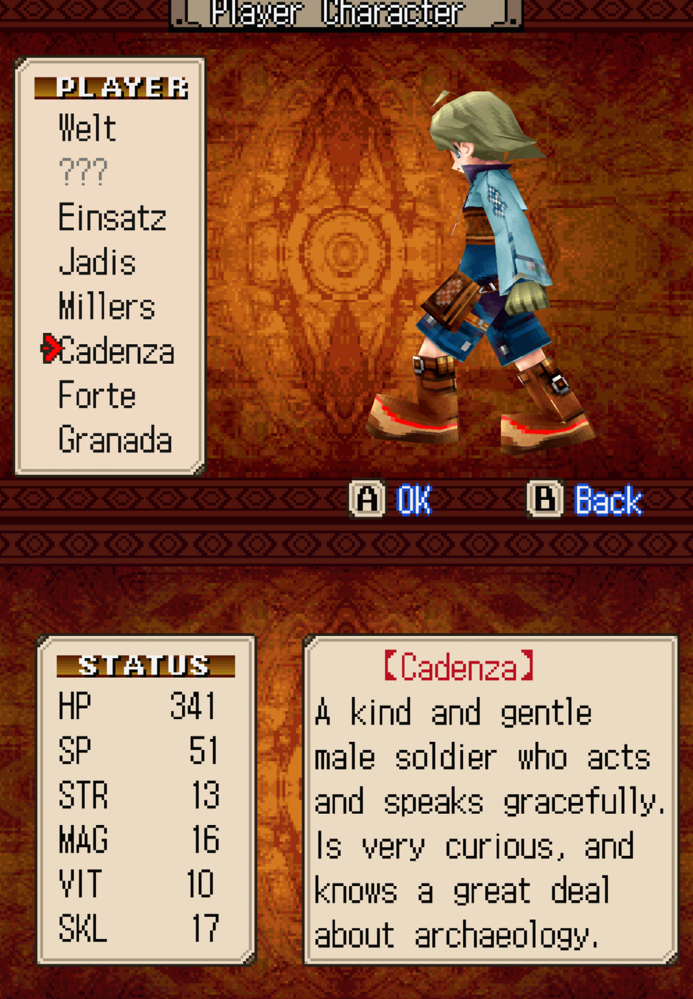
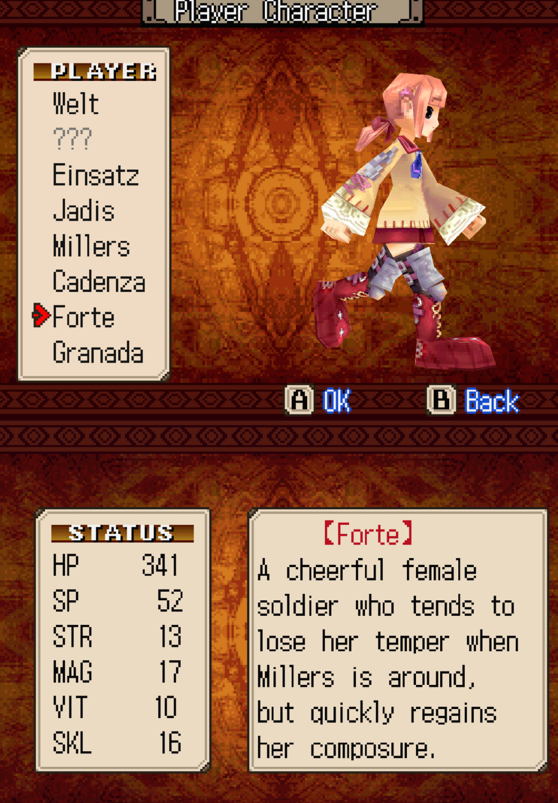
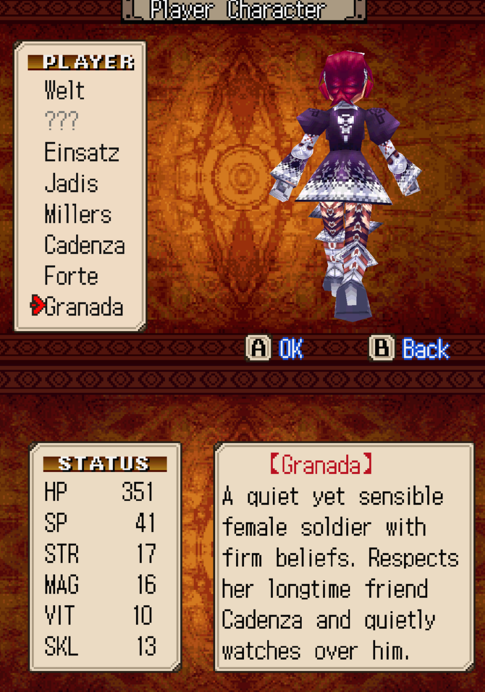
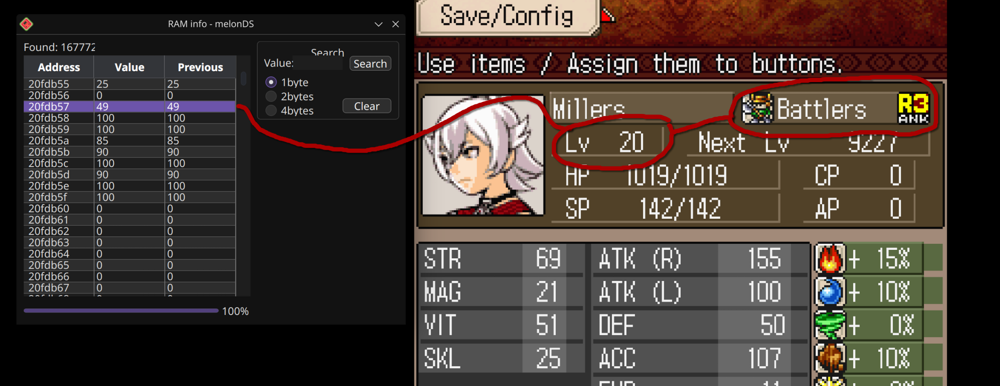
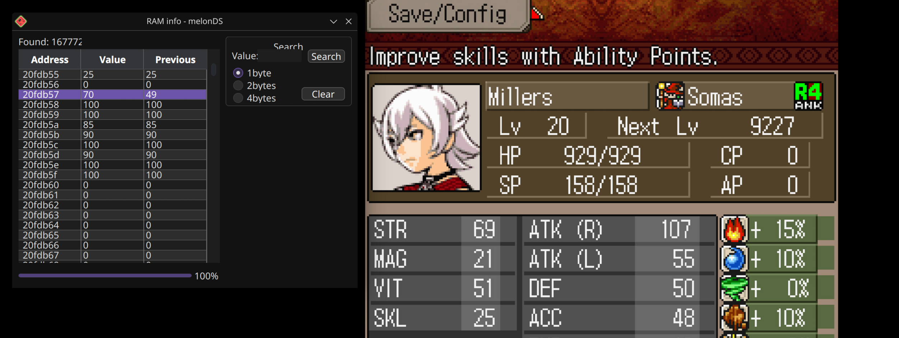

# Soma Bringer (Nintendo DS) info 

A collection of info and cheats to be able to reset your character / class / stats, as the game doesn't allow it from the start.

## Audio

- Mute BGM (The game sets from 50 to 80 this byte to control volume. Can't go further because it's probably a signed value.):
```
2210D2FC 00000000
```
- Mute SFX (same case as BGM):
```
2210D2FE 00000000
```

## Reset stats
- Set CP (2 bytes):
```
120FDC2A 0000xxxx
```
CP Formula -> `CP = 3 * (CURRENT_LVL - 1) + 7 + 5 + 5`


- Set AP (2 bytes):
```
120FDC2C 0000xxxx
```
AP Formula (adding BONUS extra points for chapter bonuses) -> `AP = 3 * (CURRENT_LVL - 1) + BONUS`


- Set initial stats (every address contains a byte for each stat.)

### Welt

```
220FDC26 0000000F
220FDC27 0000000E
220FDC28 0000000C
220FDC29 0000000F
```

</img>

### Idea
```
220FDC26 0000000D
220FDC27 00000012
220FDC28 0000000A
220FDC29 0000000F
```

</img>

### Einsatz
```
220FDC26 00000011
220FDC27 00000010
220FDC28 0000000A
220FDC29 0000000D
```

</img>

### Jadis
```
220FDC26 00000012
220FDC27 0000000D
220FDC28 0000000C
220FDC29 0000000D
```

</img>

### Millers
```
220FDC26 00000010
220FDC27 0000000D
220FDC28 0000000A
220FDC29 00000011
```

</img>

### Cadenza
```
220FDC26 0000000D
220FDC27 00000010
220FDC28 0000000A
220FDC29 00000011
```

</img>

### Forte
```
220FDC26 0000000D
220FDC27 00000011
220FDC28 0000000A
220FDC29 00000010
```

</img>

### Granada
```
220FDC26 00000011
220FDC27 00000010
220FDC28 0000000A
220FDC29 0000000D
```

</img>

## Character change

(Edit these 2 bytes)
```
::Welt
220FD908 00000080
22116076 00000000

::Idea
220FD908 00000081
22116076 00000001

::Millers
220FD908 00000082
22116076 00000002

::Cadenza
220FD908 00000083
22116076 00000003

::Jadis
220FD908 00000084
22116076 00000004

::Einsatz
220FD908 00000085
22116076 00000005

::Forte
220FD908 00000086
22116076 00000006

::Granada
220FD908 00000087
22116076 00000007
```

## Class change
0x20FDB57 -> Needed to set class and rank.
- higher 4 bits -> rank 1 to 4
- lower 4 bits -> class:
    - 1: battlers
    - 2: corps
    - 3: darks
    - 4: gunners
    - 5: kampfs
    - 6: somas

Examples: 

</img>

Value 49 in hex -> 0x31 -> rank 3, class 1 (battlers)


</img>

Value 70 in hex -> 0x46 -> rank 4, class 6 (somas)

0x2116078 -> Changes automatically on load save data (indicates class too).

Edit the cheats with desired values:

```
::Battlers
220FDB57 00000011
22116078 00000001

::Battlers (Max Level)
220FDB57 00000041
22116078 00000001

::Corps
220FDB57 00000012
22116078 00000002

::Corps (Max Level)
220FDB57 00000042
22116078 00000002

::Darks
220FDB57 00000013
22116078 00000003

::Darks (Max Level)
220FDB57 00000043
22116078 00000003

::Gunners
220FDB57 00000014
22116078 00000004

::Gunners (Max Level)
220FDB57 00000044
22116078 00000004

::Kampfs
220FDB57 00000015
22116078 00000005

::Kampfs (Max Level)
220FDB57 00000045
22116078 00000005

::Somas
220FDB57 00000016
22116078 00000006

::Somas (Max Level)
220FDB57 00000046
22116078 00000006
```